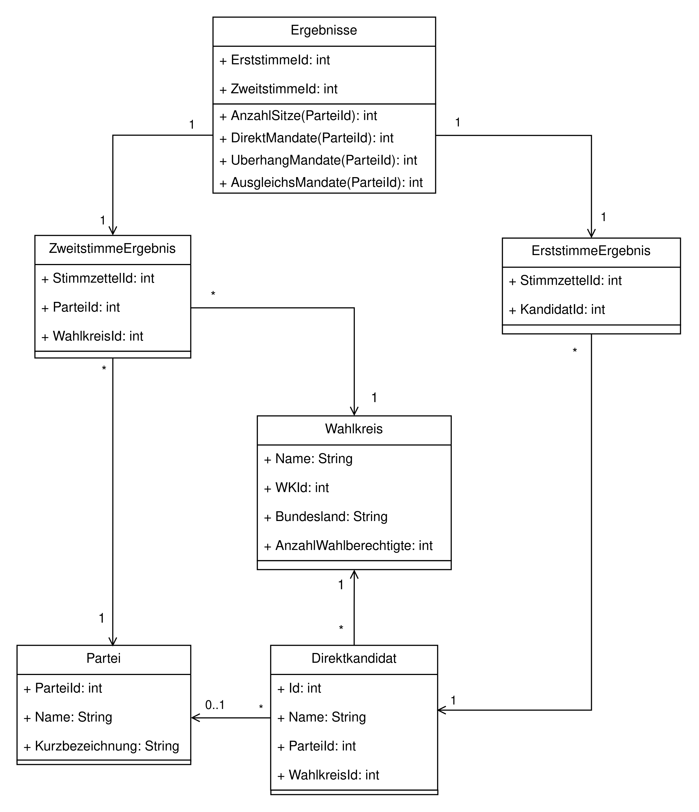

## Aufgabenblatt 1

1. Folgende Daten müssen verwaltet werden:
      * Parteien
      * Wahlkreise
      * Direktkandidaten (sowohl parteigebundene als auch unabhängige Kandidaten)
      * Ergebnisse (Erststimmenergbnisse und Zweitstimmenergebnisse)
      * (Infos uber die Wahlberechtigte: Gesamtanzahl, Anzahl pro Wahlkreis, Alterverteilung)
 
2. 
 #### Vorteile:
   * Konsistenz und Persistenz: Ein DBMS stellt sicher, dass die gespeicherten Daten konsistent und dauerhaft verfügbar sind.
   * Sicherheitsmechanismen und Datenschutz: Ein DBMS bietet Möglichkeiten zur Verwaltung von Zugriffsrechten, sodass nur berechtigte Personen auf bestimmte Daten zugreifen können. Dies ist besonders wichtig, um den Datenschutz der Wahlberechtigten zu gewährleisten.

   * Backup- und Recovery-Lösungen: Mit einem DBMS lassen sich automatische Backups und Wiederherstellungsmechanismen einfach einrichten. So können im Falle eines Systemausfalls die Daten wiederhergestellt werden, ohne die Integrität der Wahlergebnisse zu gefährden.

   * Datenanalyse und Berichterstellung
  
   * Datenarchivierung und Replikation

#### Mögliche Nachteile:
   * Komplexität der Einrichtung und Verwaltung: Die Einrichtung eines DBMS erfordert technische Expertise und kann aufwendig sein, insbesondere bei der Konfiguration von Datenschutz-, Backup- und Sicherheitsmechanismen.

   * Kosten: Ein robustes DBMS kann kostenintensiv sein, insbesondere wenn große Datenmengen verarbeitet und langzeitig archiviert werden müssen.
  
3.  

