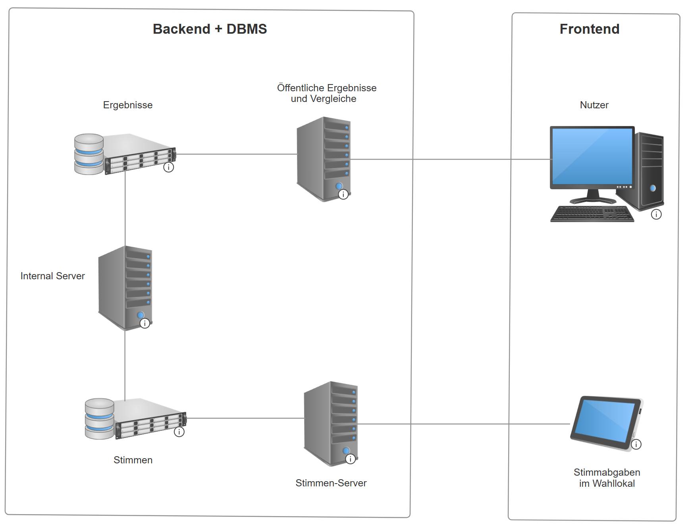

## Pflichtenheft für das Wahlinformationssystem

### Zielsetzung

#### Muss-Kriterien
- **Speicherung und Analyse der Wahldaten:**
Das System muss in der Lage sein, Einzelstimmen sicher zu speichern und Wahlergebnisse der Bundestagswahlen 2017 und 2021 darzustellen.
Nach dem Ende des Wahltages sollte das System die neuen Wahlergebnisse integrieren und Vergleiche zwischen den unterschiedlichen Jahren mittels Graphen und Tabllen durchführen. 

- **Berechnung der Sitzverteilung:**
Das System berechnet die Bundestagssitzverteilung gemäß der 5%-Sperrklausel, inklusive Überhangsmandaten.

- **Elektronische Stimmabgabe im Wahllokal:**
Das System ermöglicht nach den aktuellen Datenschutzbestimmungen sichere, anonyme und nachvollziehbare Stimmabgabe für berechtigte Benutzer im Wahllokal.

#### Soll-Kriterien
- **Benutzerfreundliche Oberfläche:**
Einfache und intuitive GUI für Wähler und Analysen.

- **Konsistenz bei gleichzeitigen Zugriffen:**
Die Datenbank muss isolierte Transaktionen gewährleisten, um Datenkonsistenz zu wahren.

- **Sehr hohe Verfügbarkeit:** insbesondere an Wahltagen: eine Stimmabgabe muss innerhalb von 2 Sekunden verarbeitet werden.

#### Kann-Kriterien
- **Mehrsprachige Unterstützung:**
Optionales Angebot einer Benutzeroberfläche in weiteren Sprachen neben Deutsch.

- **Erweiterte Visualisierungsoptionen:**
bspw. Heatmaps oder geografische Darstellungen der Ergebnisse nach Region oder Stimmkreis, könnten hinzugefügt werden, um die Datenanalyse zu verbessern.

#### Abgrenzungskriterien
- **Tracking der individuellen Stimmabgaben:** Das System kann nicht nachverfolgen, welche Personen abgestimmt haben, und kann nicht auf individuelle Stimmabgaben zugreifen. Dies gewährleistet die Anonymität der Wähler.
- **Zugriffsrestriktionen auf Stimmabgaben während Wahltagen:** Das System hat nur Lesezugriff auf die veröffentlichten Wahlergebnisse. Die Stimmabgabe-Schnittstelle ist nur in Wahllokalen verfügbar und kann außerhalb der Wahllokale während der Wahltage nicht aufgerufen werden.

### Technische Umsetzung

#### Architekturüberblick
- **Datenbankmanagementsystem (DBMS):**
Zur Speicherung der Einzelstimmen und Wahldaten. Die Datenbank wird verschlüsselt, um die Sicherheit und Anonymität der Daten zu gewährleisten.
Das Datenmodell besteht aus den folgenden Entitäten und Relationen:

- **Backend (Application Server):** besteht aus Server, die es ermöglichen:
  - Die Analyse- und Vergleich-Anfragen der Nutzer zu verarbeiten.
  - Die Einzelstimmen-anfragen an den Wahltagen zu überprüfen und in das DBMS zu speichern.
  - Die Ergebnisse nach den Wahltagen in die Ergebnisse-DB zu aggregieren.
- **Frontend (Web-Client):** besteht aus zwei Anwendungen:
  - Eine benutzerfreundliche Schnittstelle für die Ergebnisanalyse und Ergebnisvergleiche.
  - Eine benutzerfreundliche Schnittstelle für die Stimmabgabe.

#### Komponenten-Interaktion

- Nutzer dürfen jederzeit die vorherigen Wahlergebnisse ansehen, analysieren und Wahlergebnissen miteinander vergleichen, in dem sie Anfragen zum Server der öffentlichen Ergebnisse schickt. 
- Der Server der öffentlichen Ergebnisse lädt sie aus der Datenbank, die alle öffentlichen Ergebnisse (insb. von den Jahren 2017 und 2021) speichert.
- Die Stimmen werden in Wahllokalen abgegeben, wobei die Stimmabgabe als Anfrage zum Stimmen-Server geschickt. 
- Der Stimmen-Server überprüft die Validität der Anfrage und speichert valide Stimmen in der Stimmen-Datenbank.
- Ein (zum Außen nicht sichtbarer) Internal Server wird eventuell an und nach den Wahltagen die Einzelstimmen aggregieren und mit den öffentlichen Ergebnissen rechtzeitig speichern.
- Firewalls und Load-Balancers werden im Diagramm nicht angegeben, sind aber für Sicherheit- und Zugriffsberechtigungsgründen nötig.
- Datenredundanz ist auch im Diagramm nicht berücksichtigt, aber für eine hohe Verfügbarkeit an den Wahltagen in Form eines RAID-Systems verwendet.

#### Benutzer-Oberfläche 
Ein Überblick ist auf [Figma](https://www.figma.com/proto/gGm4p1eNUpWRlI9xZu1wLC/votealyze?node-id=6-3776&node-type=canvas&t=SuFTL7pMOP9HHw80-1&scaling=min-zoom&content-scaling=fixed&page-id=0%3A1) verfügbar.
Die Oberfläche besteht aus zwei Schnittstellen:
- **Eine Ergebnis- und Vergleichsanalyse-Schnittstelle** mit den folgenden Komponenten:
  - Einem Filter, das die Auswahl der Wahlergebnisse nach Jahr, Bundesland und Wahlkreis und im Vergleich mit anderen Jahren und/oder Wahlkreisen ermöglicht.
  - Einem Top-Menu mit der Möglichkeit die Sprache auszuwählen.
  - Einem Main-View, das alle grafischen und interaktiven Ergebnisse anzeigt, inklusiv die Sitzverteilung, möglichen Koalitionen, sowie die prozentualen Wahlergebnisse jeder Partei.
- **Eine Stimmabgabe-Schnittstelle** mit den folgenden Komponenten:
  - Eine Login-Schnittstelle, die die Stimmabgabe nur nach Eingabe eines gültigen Tokens ermöglicht.
  - Nach erfolgreichem Login wird ein digitaler Stimmzettel angezeigt, der auch ungültige Stimmen zulässt. Der Stimmzettel enthält einen "Abstimmen"-Knopf, der bei Klick ein Bestätigungs-Pop-up-Fenster anzeigt. Nach der Bestätigung wird die Stimme in Form einer Anfrage zum Stimmen-Server abgegeben.

### Glossar
| Begriff              | Beschreibung |
|----------------------|--------------|
| **(Mögliche) Koalition** | Ein Zusammenschluss mehrerer Parteien, die gemeinsam eine Regierung bilden, wenn keine einzelne Partei die absolute Mehrheit der Sitze im Bundestag erreicht. In der Analyse werden oft mögliche Koalitionen anhand der Sitzverteilung geprüft, um zu sehen, welche Parteien eine regierungsfähige Mehrheit bilden könnten. |
| **Ausgleichsmandate**| Zusätzliche Mandate, die vergeben werden, um das Kräfteverhältnis im Bundestag auszugleichen, wenn durch Überhangmandate eine Verzerrung zugunsten einzelner Parteien entsteht. Ausgleichsmandate sorgen dafür, dass die Sitzverteilung im Bundestag wieder dem Verhältnis der Zweitstimmen entspricht und das Wahlergebnis proportional bleibt. Sie werden auf andere Parteien verteilt, die keine Überhangmandate erhalten haben, um die Gleichheit der Wahl sicherzustellen. |
| **Bundestagswahl**   | Die Wahl zum Deutschen Bundestag, die alle vier Jahre stattfindet und bei der die Abgeordneten gewählt werden. |
| **Datenschutz**      | Maßnahmen und Regelungen, die sicherstellen, dass personenbezogene Daten der Wahlbeteiligten geschützt und nur im erlaubten Rahmen verwendet werden. |
| **Erststimme**       | Stimme, die Wähler für einen Direktkandidaten in ihrem Wahlkreis abgeben, um diesen direkt in den Bundestag zu wählen. |
| **Filter**           | Mechanismus, der es Benutzern ermöglicht, die angezeigten Daten nach bestimmten Kriterien wie Jahr, Region oder Partei einzugrenzen. |
| **Minderheitspartei** | Eine Partei, die bei einer Wahl weniger als 5% der Stimmen erhält und daher möglicherweise nicht im Bundestag vertreten ist. |
| **Sitzverteilung** | Die Aufteilung der Sitze im Bundestag basierend auf den Wahlergebnissen. Die Sitzverteilung zeigt, wie viele Abgeordnete jede Partei im Bundestag stellt und ist entscheidend für die Bildung von Mehrheiten und Koalitionen. |
| **Sperrklausel (5%-Hürde)** | Regelung, nach der Parteien mindestens 5% der Zweitstimmen erhalten müssen, um in den Bundestag einzuziehen. |
| **Stimmenaggregation** | Der Prozess des Zusammenfassens der Einzelstimmen zu einem aggregierten Wahlergebnis pro Wahlkreis. |
| **Stimmkreis**       | Ein geografisches Gebiet, das durch eine Direktwahl einen Abgeordneten in den Bundestag wählt; entspricht in der Regel einem Wahlkreis. |
| **Stimmzettel**      | Das Medium, auf dem Wähler ihre Wahlentscheidung abgeben. In diesem Wahlinformationssystem handelt es sich um einen elektronischen Stimmzettel, der digital bereitgestellt wird. |
| **Token**            | Ein einmaliger, eindeutiger Code oder digitale Berechtigung, die einem Wähler anonym zugeteilt wird, um sicherzustellen, dass jede Person nur eine gültige Stimme abgeben kann, ohne Rückschlüsse auf die Identität des Wählers zuzulassen. Der Token dient ausschließlich zur Authentifizierung des Wahlvorgangs, ohne personenbezogene Daten zu erfassen, und wahrt somit die Anforderungen an Datenschutz und die Geheimhaltung der Wahl. |
| **Überhangsmandate** | Zusätzliche Mandate, die eine Partei erhält, wenn sie in einem Bundesland mehr Direktmandate als Sitze gemäß dem Zweitstimmenergebnis gewonnen hat. |
| **Zugriffskontrolle** | Sicherheitsmaßnahmen, die den Zugang zum System regulieren, um Datenintegrität und Datenschutz zu gewährleisten. |
| **Zweitstimme**      | Stimme, die Wähler für eine Partei abgeben, um deren Gesamtsitzverteilung im Bundestag zu bestimmen. |
