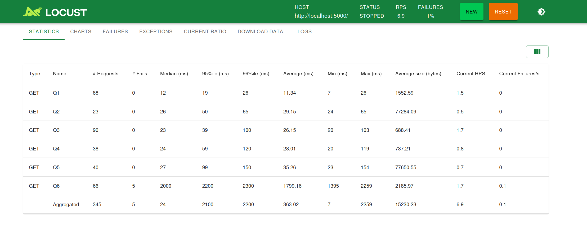

# BundestagswahlInformationssystem

## 📝 Documentation

- [Lastenheft](./documentation/Lastenheft.md)
- [Pflichtenheft](./documentation/Pflichtenheft.md)
- [Glossar](./documentation/Glossar.md)
- [UML Diagram](./resources/wahlen.png)
- [Electronic Voting Explainer](./documentation/e-Stimme.md)
- [Folien](https://docs.google.com/presentation/d/1MNZbIEK26Fst6yqrsjcrRo14GeKyhvlDwGQgXrLv5-k/edit#slide=id.g324cc20295a_0_0)

#### Aktuelles UML-Diagramm unseres Systems:


## 🔧 Getting Started

After cloning the repository:

## Server

### Using Docker:

Run the following command in the respository folder to spawn the databases and the keycloak instance:

```shell
docker-compose up -d
```

### Data cleaning, Database tables generation:

1. navigate to `backend/databases/results` , then run

   ```shell
   alembic upgrade head
   ```

2. navigate to `backend/databases/voting`

   ```shell
   alembic upgrade head
   ```

3. run the script `scripts/generate_all_tables.py`
4. Seat Distribution calculation: execute the SQL script `scripts/ergebnisse_berechnung.sql`

### Starting the backend Services:

1. Add keycloak config to the virtual environment:
   add to `.venv/` the following `keycloak_config.json` file:

```json
{
  "jwks_url": "http://localhost:8080/realms/BundestagswahlInformationssystem/protocol/openid-connect/certs",
  "audience": "account",
  "issuer": "http://localhost:8080/realms/BundestagswahlInformationssystem"
}
```

2. Add keycloak client secrets to the virtual environment:
   add to `.venv/` the following `client_secrets.json` file:
```json
{
  "web": {
    "issuer": "http://localhost:8080/realms/BundestagswahlInformationssystem",
    "auth_uri": "http://localhost:8080/realms/BundestagswahlInformationssystem/protocol/openid-connect/auth",
    "client_id": "account",
    "client_secret": "JKUsf8FvDJ9LQxUz0vqSzwtxaF17PlXg",
    "token_uri": "http://localhost:8080/realms/BundestagswahlInformationssystem/protocol/openid-connect/token",
    "redirect_uris" : ["http://localhost:5000/*"],
    "userinfo_uri": "http://localhost:8080/realms/BundestagswahlInformationssystem/protocol/openid-connect/userinfo"
  }
}
```

You can edit the configurations depending on the settings you chose for keycloak. 
However, for a demo, these settings correspond to the keycloak settings stored in
[portal-real.json](./keycloak/portal-realm.json)

3. navigate to `backend/rest/`, then start both servers: `server.py` and `identity_server.py`

## Client

### Alternative 1: Using docker for current development version:

navigate to `/frontend` then run

```shell
 docker compose up -d
```

### ALternative 2: Starting from code

#### Votealyze

1. navigate to frontend/votealyze
2. add environment variable for the backend url, for that create a `.env.development` file and add `REACT_APP_API_URL=http://localhost:5000`
3. start the application:
   ```shell
   npm install
   ```
   ```shell
   npm start
   ```

#### e-Stimme

1. navigate to frontend/e-stimme
2. specify a different port as votealyze, for that create a `.env` file and add `PORT=3001`
3. add environment variable for the backend url, for that create a `.env.development` file and add `REACT_APP_API_URL=http://localhost:5001`
4. start the application:
   ```shell
   npm install
   ```
   ```shell
   npm start
   ```

## ⚡ Benchmarks

For benchmarking, we use [locust](https://locust.io/).

1. navigate to [backend/rest/benchmark.py](backend/rest/benchmark.py)
2. run the command

```shell
   locust -f benchmark.py --host=http://localhost:5000/ --users <number_of_users> --spawn-rate <number_of_started_clients_per_sec> --run-time <time>
```

An example for 10 users, 2 second spawn rate and a runtime of 2 minutes:


## 💻 Demo

#### Votealyze

[votealyze.webm](https://github.com/user-attachments/assets/34c99c0d-9d23-4b93-945b-2b1ac1769a3d)

#### e-Stimme


https://github.com/user-attachments/assets/7ff5e4be-0fb7-452e-9863-4ede7bfd30bd


