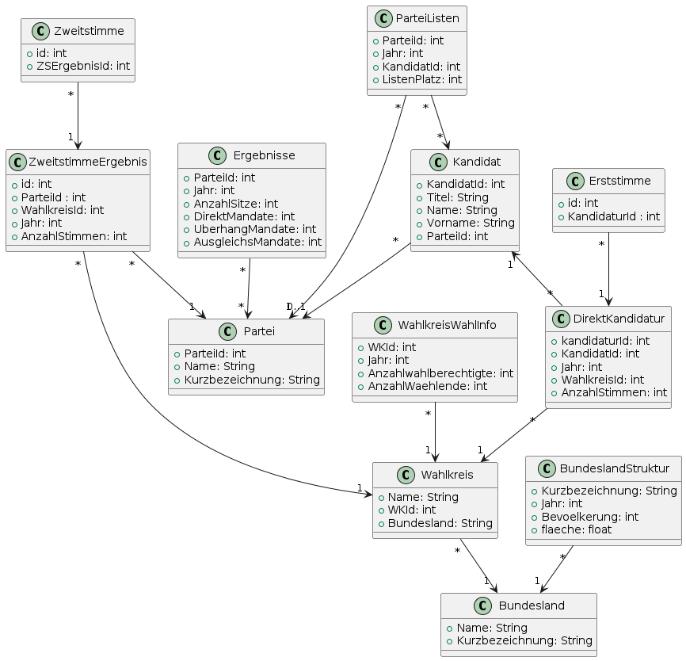

# BundestagswahlInformationssystem

#### Aktuelles UML-Diagramm unseres Systems:

#### Aktuelles Lastenheft unseres Systems:
Das aktuelle Lastenheft ist in der Datei [Lastenheft.md](./Lastenheft.md) verfügbar.
