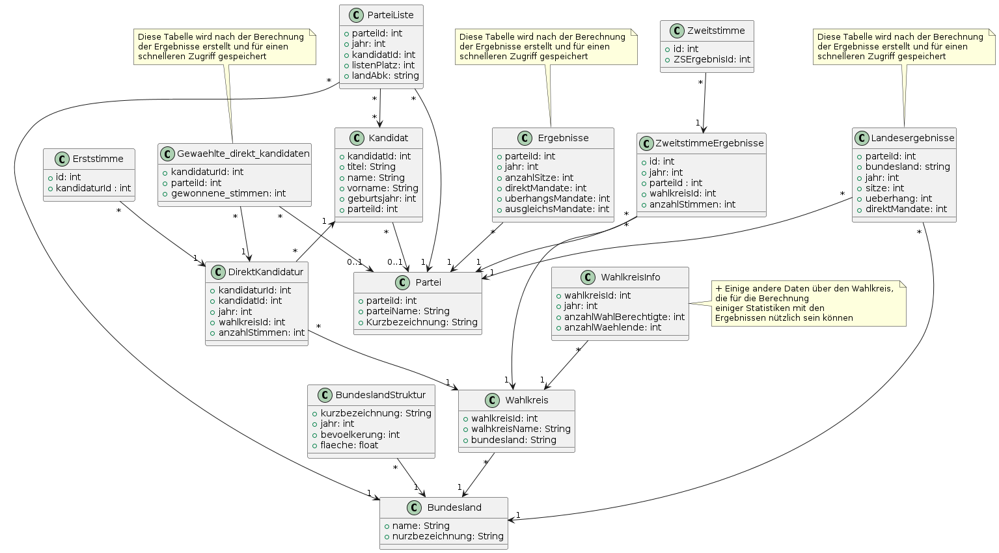

# BundestagswahlInformationssystem

## 📝 Documentation

- [Lastenheft](./documentation/Lastenheft.md)
- [Pflichtenheft](./documentation/Pflichtenheft.md)
- [Glossar](./documentation/Glossar.md)
- [UML Diagram](./resources/wahlen.png)
- [Electronic Voting Explainer](./documentation/e-Stimme.md)

#### Aktuelles UML-Diagramm unseres Systems:

## 🔧 Getting Started

After cloning the repository:

## Server

### Using Docker:

Used to spawn the databases and the keycloak instance.

`docker-compose up -d`

### Data cleaning, Database tables generation:

1. navigate to backend/databases/results , then  
   `alembic upgrade head`

2. navigate to backend/databases/voting  
   `alembic upgrade head`

3. run the script scripts/generate_all_tables.py

### Starting the backend Services:

navigate to backend/rest/, then start both servers: `server.py` and `identity_server.py`

## Client

### Alternative 1: Using docker for current development version:

navigate to `/frontend` then run `docker compose up -d`

### ALternative 2: Starting from code

#### Votealyze

1. navigate to frontend/votealyze
2. add environment variable for the backend url, for that create a `.env.development` file and add `REACT_APP_API_URL=http://localhost:5000`
3. start the application:  
   `npm install`
   `npm start`

#### e-Stimme

1. navigate to frontend/e-stimme
2. specify a different port as votealyze, for that create a `.env` file and add `PORT=3001`
3. add environment variable for the backend url, for that create a `.env.development` file and add `REACT_APP_API_URL=http://localhost:5001`
4. start the application:  
   `npm install`
   `npm start`

## ⚡ Benchmarks

## 💻 Demo

#### Votealyze

#### e-Stimme
