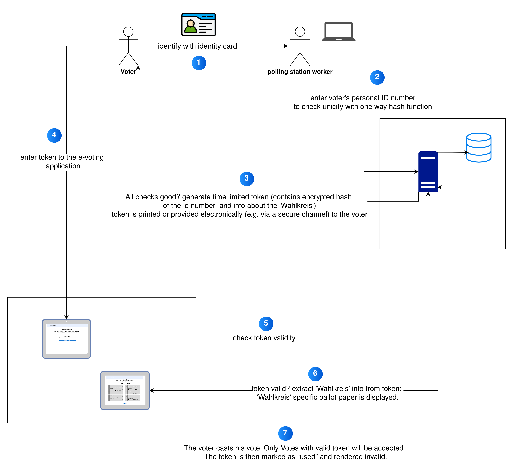
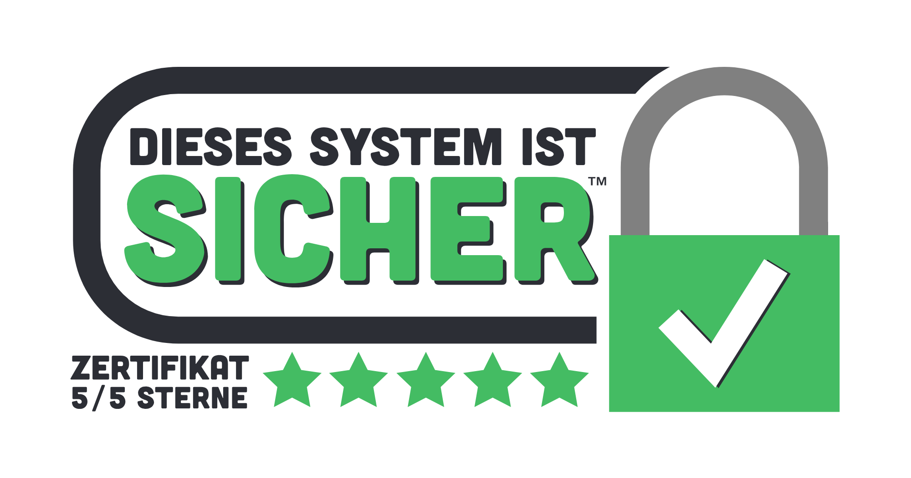

## Prozessbeschreibung der e-Stimmabgabe

1. Identifikation des Wählers:

- Der Wähler identifiziert sich mit einem gültigen Ausweisdokument.
- Ein Wahllokalmitarbeiter überprüft die Identität und den Wahlkreis.

2. Registrierung des Wählers:

- Die Personal-ID-Nummer des Wählers wird in das System eingegeben.
- Die ID-Nummer wird gehasht (z. B. mit SHA-256) und gespeichert (Ein Einweg-Hash wird verwendet, um sicherzustellen, dass dieselbe Person nicht mehrfach wählen kann, ohne Rückschluss auf die ID zuzulassen)

3. Token-Generierung:

- Ein zeitlich begrenztes Token (z. B. 10 Minuten gültig) wird generiert. Das Token enthält:

  - Einen verschlüsselten Hash der Wähler-ID.
  - Informationen über den Wahlkreis.

- Das Token wird ausgedruckt oder elektronisch dem Wähler bereitgestellt.

#### Stimmabgabe im Wahlkabine:

4. Der Wähler gibt das Token in das Terminal in der Wahlkabine ein

5. Das System prüft die Gültigkeit des Tokens

- Zeitliche Gültigkeit.
- Einmalige Verwendung (Prüfung gegen die gespeicherten Tokens).

6. Ein für den Wahlkreis gültiger Stimmzettel wird angezeigt.

7. Der Wähler gibt seine Stimme ab. Das Token wird daraufhin als „verbraucht“ markiert und ungültig gemacht.

## Technische Umsetzung

#### Systemkomponenten

- Datenbank:
  - Speichert gehashte Wähler-IDs, Tokens und den Status der Stimmabgabe.
  - Verhindert SQL-Injection durch vorbereitete Statements und ORM.
- Token-System:
  - Generiert zeitlich beschränkte Tokens (z. B. JSON Web Tokens, JWT) mit Signatur.
  - Überprüft die Token-Gültigkeit bei der Stimmabgabe.
- Benutzer-Schnittstelle:
  - Für Mitarbeiter: Einfaches UI zur Eingabe von ID-Nummern und Ausgabe von Tokens (nur für Mitarbeiter des Wahllokals zugänglich; login erforderlich)
  - Für Wähler: Touchscreen oder Tastatur zur Eingabe des Tokens und zur Stimmabgabe.

#### Sicherheitsmaßnahmen

- Datenschutz:
  - Speicherung der Wähler-IDs nur in gehashter Form.
- Token-Sicherheit:
  - Verschlüsselung und Signatur schützen vor Manipulation.
  - Zeitliche Begrenzung minimiert Missbrauchsmöglichkeiten.
- Manipulationsschutz:
  - Das System erkennt und blockiert mehrfach verwendete Tokens.
  - Zugriffskontrollmechanismen: Nur Wahllokalmitarbeiter können auf die Benutzeroberfläche zugreifen, um die ID-Nummer einzugeben.
  - [Nice to have]: Überwachung und Logging von Anomalien (z. B. zu viele ungültige Token-Versuche).
- Wahlbetrugsschutz:
  - Datenbank prüft, ob die ID bereits verwendet wurde.

source: https://github.com/SFTtech/sticker/tree/master/sicher
